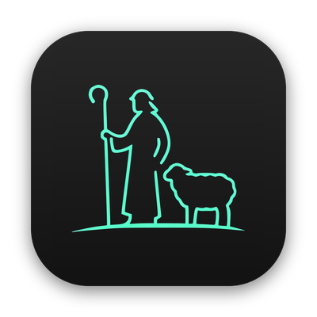

<div align="center">



# rai

**A native macOS window for your [herdr](https://herdr.dev) herd.**

herdr is a terminal multiplexer and live daemon for AI coding agents - but its
frontend is a TUI. `rai` is a thin, fast native client over herdr's socket API:
a real AppKit/SwiftUI window with a workspace sidebar, tabs, splits, drag, and
per-pane terminals - driving the **unchanged** herdr daemon underneath.


[](https://github.com/YogevKr/rai/actions/workflows/ci.yml)
[](https://github.com/YogevKr/rai/releases/latest)

</div>

---

## The name

**rai** comes from the Arabic **رَاعِي** (*rāʿī*) - a *shepherd*, one who tends
and watches over a flock. It's built on the triliteral root **ر‑ع‑ي** (*r‑ʿ‑y*),
which carries the sense of pasturing, guarding, and caring for; the same root
gives **رِعَايَة** (*riʿāya*), "care" or "guardianship."

The fit is deliberate: **herdr** keeps the *herd* of agents; **rai** is the
shepherd that watches over them - a calm window from which you keep an eye on the
flock and step in only when one needs you.

## Why

herdr is a **live daemon**: detach and your agents keep running mid-flight;
reattach to the same live processes, locally or over SSH. That's its edge over
"save & resume" GUIs that stop processes on quit and reconstruct the layout
later. `rai` keeps herdr's daemon-grade detach + remote + plugin/agent ecosystem
and adds the native single-window GUI — no herdr fork, no runtime patches, no
AppleScript terminal-puppetry. The app is fundamentally **socket client +
terminal widget**.

## Features

- **Live workspace sidebar** - workspaces → tabs → panes straight from
  `session.snapshot`, kept live by herdr's event stream (no polling loop).
- **Real terminal panes** — powered by [SwiftTerm](https://github.com/migueldeicaza/SwiftTerm);
  type, watch output, search the scrollback (⌘F).
- **Low-latency typing** — confirmed shell echo predicts safe ASCII bursts.
  TUI modes, copy mode, resizing, and scrollback always clear the prediction.
  Small focused-pane echoes bypass the normal display throttle.
- **Nested splits** — rendered from the daemon's own split geometry and ratios.
- **Split &amp; launch an agent** — spawn Claude or Codex directly into a new pane.
- **Broadcast input** — send one command to every pane in a tab.
- **Drag to reorder** tabs and spaces; **double-click** to rename a tab or pane.
- **Native notifications** + dock badge when an agent goes *blocked* or *done*.
- **Claude hook beacons** put real tool requests or questions in notifications
  and blocked sidebar rows, with no permission decisions.
- **Command palette** (⌘K) for fuzzy navigation.
- **Ghostty-matched theme** (Dracula+) with a configurable terminal font, plus
  Ghostty line-editing key parity, non-ASCII (e.g. Hebrew) input, and image paste
  that hands screenshots straight to Claude Code.
- **Settings** for the herdr server, appearance, plugins, and integrations.
- **Rai Remote, an iPhone companion** — the whole herd in your pocket. See
  below.

## Rai Remote — iPhone companion

A native iOS app (`ios/`) that pairs with the Mac over your LAN or Tailscale
(QR code, deep link, or manual entry) and turns the phone into a shepherd's
crook for the herd:

- **Triage first** — agents that *need you* float to the top, with Working /
  Idle groups and per-workspace status. A **Triage groups** toggle in the
  connection menu turns the groups and the pulse line off for a plain
  space → tab → pane list.
- **Useful offline** — the last herd appears at launch with its saved time.
  Rai mutes cached rows and replaces them after the Mac sends a live snapshot.
- **Clear connection help** — the phone names DNS, route, listener, TLS,
  pairing, and missing-herdr failures. Raw connection details remain available.
- **Live terminals** — the real pane, streamed and colored, with ~1000 lines
  of scrollback seeded from herdr's history; swipe through what happened
  while you were away.
- **Answer Claude without reading a TUI** — permission and choice dialogs
  render as native tappable buttons, race-guarded so a stale tap can never
  answer the wrong prompt.
- **Type for real** — a compose bar with quick replies and an agent-aware
  slash-command palette, or put the keyboard straight into the pty; input
  rides herdr's key semantics, so Enter submits and Backspace erases.
- **Launch from anywhere** — Claude, Codex, or a plain terminal, into any
  workspace or a fresh one at a chosen directory.
- **Push notifications** (APNs) when agents block or finish. Bursts coalesce,
  workspaces group, handled alerts retract, and single alerts keep actions.

The Mac side is the hub: a per-device authenticated WebSocket bridge
(**Settings → iPhone**) that the phone reaches over the LAN or through
`tailscale serve`. Build, pairing, and push setup live in
[docs/ios.md](docs/ios.md).

## Requirements

- macOS 14 (Sonoma) or newer
- [**herdr**](https://herdr.dev) on your `PATH` — rai starts the server itself
  when the herd it points at is not running
- Xcode command-line tools / Swift 5.9+ toolchain (to build)

## Install

### Homebrew

```sh
brew install --cask yogevkr/tap/rai
```

### Download

Grab the latest `.dmg` from the
[**Releases**](https://github.com/YogevKr/rai/releases/latest) page, open it, and
drag **Rai** into Applications. The build is a universal binary (Apple Silicon +
Intel).

Releases are signed with a Developer ID and notarized by Apple, with the ticket
stapled into both the app and the disk image, so Gatekeeper accepts them on the
first launch — offline included. (Builds before 0.1.26 were ad-hoc signed and
needed `xattr -dr com.apple.quarantine`; that is no longer necessary.)

### Build from source

```sh
git clone https://github.com/YogevKr/rai.git
cd rai
./scripts/bundle.sh          # builds a release Rai.app and installs it
open -a Rai
```

Or run straight from the package during development:

```sh
swift run rai
```

`rai` connects to `~/.config/herdr/herdr.sock` by default. Set
`HERDR_SOCKET_PATH` to point at a different socket (e.g. a named session).

See [docs/TESTING.md](docs/TESTING.md) for the full local workflow: building,
screenshotting the running app, and end-to-end verification against a live herdr
daemon without disturbing your running agents.

## Usage

Launch `rai` and the sidebar populates with your live herd. If that herd's server
is not running, rai starts it and connects once it is ready. Click a tab to
attach its panes; type as you would in any terminal.

### Keyboard shortcuts

| Shortcut | Action |
| --- | --- |
| `⌘K` | Command palette |
| `⌘T` / `⌘W` | New / close tab |
| `⌃⇥` / `⌃⇧⇥` | Next / previous tab |
| `⌘1`…`⌘9` | Select tab by index |
| `⌘D` / `⌘⇧D` | Split right / down |
| `⌘⇧W` | Close pane |
| `⌘⇧↩` | Zoom pane |
| `⌥⌘←/→/↑/↓` | Focus pane in direction |
| `⌘N` | New space (workspace) |
| `⌘⇧]` / `⌘⇧[` | Next / previous space |
| `⌘F` / `⌘G` / `⌘⇧G` | Find / next / previous in scrollback |
| `⌘R` | Refresh |

Double-click a tab or pane title to rename it; drag a tab or space in the sidebar
to reorder.

## How it works

```
  herdr daemon (unchanged)
        │  unix socket: ~/.config/herdr/herdr.sock
        │  newline-delimited JSON-RPC + a live event stream
        ▼
  rai (native macOS app)
   ├─ HerdrClient   session.snapshot + events.subscribe → an observable model
   ├─ Hook socket   Claude lifecycle JSON → correlated pane beacons
   ├─ Sidebar/Tabs  SwiftUI/AppKit views bound to that model
   ├─ PaneView      terminal widget:
   │                  content   ← pane read / terminal frame stream
   │                  keystrokes → pane input
   │                  splits     ← layout snapshots + ratios
   └─ Bridge        per-device authenticated WebSocket for Rai Remote
        ▲
        │  ws:// on the LAN · wss:// via tailscale serve
  Rai Remote (iPhone)
```

rai speaks herdr's documented `herdr.sock` RPC: `session.snapshot` for the tree,
`events.subscribe` for live deltas (`layout.updated`,
`pane.created/closed/moved/focused`, `pane.agent_status_changed`, `tab.closed`),
plus `pane`/`tab`/`workspace`/`agent` methods to drive it. Two connections are
held open — one for RPC, one for the event push.

### Explore the API without Swift

The `poc/` folder has a small Python client that exercises the same socket, handy
for poking at herdr directly:

```sh
poc/herdr_client.py tree               # render the live workspace/tab/pane tree
poc/herdr_client.py watch              # stream live events
poc/herdr_client.py read <pane_id>     # dump a pane's recent content
poc/herdr_client.py send <pane_id> "echo hi\n"
```

## Project layout

```
Sources/RaiApp     SwiftUI/AppKit app — views, terminal panes, settings, commands
Sources/RaiCore    HerdrClient (socket RPC + event stream), model types, fuzzy match
Sources/RaiProbe   headless socket probe (rai-probe) for transport checks
Tests/RaiCoreTests unit tests
scripts/bundle.sh  builds and installs Rai.app
poc/               reference Python herdr socket client
ios/               Rai Remote — the iPhone companion (xcodegen project)
docs/ios.md        iOS companion app — build, run on device, pairing
docs/ios-parity.md macOS ↔ iOS parity matrix + backlog
docs/collie-gap.md feature-gap audit vs collie (the herdr phone PWA)
docs/TESTING.md    build, screenshot, and safe end-to-end verification workflow
docs/ROADMAP.md    herdr API coverage + build plan
```

## Credits

Terminal emulation by [SwiftTerm](https://github.com/migueldeicaza/SwiftTerm)
(Miguel de Icaza, MIT). Built on top of [herdr](https://herdr.dev).

## License

[MIT](LICENSE)
