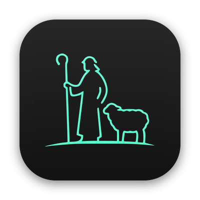

<div align="center">



# rai

**A native macOS window for your live [herdr](https://herdr.dev) sessions.**

[](https://github.com/YogevKr/rai/actions/workflows/ci.yml)
[](https://github.com/YogevKr/rai/releases/latest)
[](https://github.com/YogevKr/rai/releases/latest)
[](LICENSE)

</div>

rai is a fast native client for the herdr daemon. Your agents keep running in
herdr while rai gives you a clear window to watch, guide, and switch between them.

## What you get

- Live workspaces, tabs, splits, and terminal panes.
- Direct Claude and Codex launch, input broadcast, and command search.
- Fast typing, scrollback search, copy mode, image paste, and file links.
- Native notifications for blocked and finished agents.
- Claude hook beacons for permission and question prompts.
- Independent windows with separate workspace and pane selection.
- Drag to reorder. Double-click to rename. Reopen closed tabs and panes.
- A native iPhone companion for triage, terminals, history, prompts, and alerts.

rai uses herdr's socket API. It does not fork herdr or stop your sessions when
the app closes.

## Install

### Homebrew

```sh
brew install --cask yogevkr/tap/rai
```

### Download

Download the latest signed `.dmg` from the
[Releases](https://github.com/YogevKr/rai/releases/latest) page. Move Rai to
Applications and launch it. The release is a universal macOS 14+ app.

### Build from source

Requirements: macOS 14+, Swift 5.9+, and [herdr](https://herdr.dev) on your
`PATH`.

```sh
git clone https://github.com/YogevKr/rai.git
cd rai
./scripts/bundle.sh
open -a "Rai Dev"
```

For a quick development loop:

```sh
swift run rai
```

Set `HERDR_SOCKET_PATH` to use a named herdr session. Rai starts a stopped
local server when it can find the herdr executable.

## Shortcuts

| Shortcut | Action |
| --- | --- |
| `⌘K` | Command palette |
| `⌘T` / `⌘W` | New / close tab |
| `⌃⇥` / `⌃⇧⇥` | Next / previous tab |
| `⌘1`…`⌘9` | Select tab |
| `⌘D` / `⌘⇧D` | Split right / down |
| `⌘⇧W` | Close pane |
| `⌘⇧T` | Reopen closed tab |
| `⌘⇧P` | Reopen closed pane |
| `⌘⇧↩` | Zoom pane |
| `⌥⌘←/→/↑/↓` | Focus a pane |
| `⌘N` | New workspace |
| `⌘⇧]` / `⌘⇧[` | Next / previous workspace |
| `⌘F` / `⌘G` / `⌘⇧G` | Find in scrollback |
| `⌘R` | Refresh |

## Rai Remote

Build the iPhone companion from `ios/`. Pair it from **Settings → iPhone** by
QR code, deep link, or manual entry. It connects through the authenticated
bridge on your LAN or Tailscale.

The phone app shows the herd, keeps a useful offline snapshot, streams terminal
output, supports history and text selection, and sends prompt decisions. It can
also launch agents, manage machines and worktrees, inspect images, and receive
push alerts.

See [docs/ios.md](docs/ios.md) for pairing and push setup.

## How it works

```text
herdr daemon ── Unix socket ── rai macOS app ── authenticated bridge ── iPhone
```

The Mac client reads `session.snapshot`, listens for herdr events, and attaches
terminal views to live panes. The daemon owns the processes, layouts, and
scrollback.

Explore the socket without Swift:

```sh
poc/herdr_client.py tree
poc/herdr_client.py watch
poc/herdr_client.py read <pane_id>
poc/herdr_client.py send <pane_id> "echo hi\n"
```

## Test and contribute

Run the focused Swift tests:

```sh
DEVELOPER_DIR=/Applications/Xcode.app/Contents/Developer \
  swift test --scratch-path .build-tests
```

Use [docs/TESTING.md](docs/TESTING.md) for isolated Mac and iOS app tests,
Herdr labs, release checks, and end-to-end evidence.

Project map:

```text
Sources/RaiApp       macOS app and views
Sources/RaiCore      herdr client, wire types, and shared logic
Tests                 macOS and shared tests
ios                   iPhone app and simulator tests
scripts               build and lab tools
poc                   Python socket client
```

## Credits

Terminal emulation uses [SwiftTerm](https://github.com/migueldeicaza/SwiftTerm).
The app runs on [herdr](https://herdr.dev).

## License

[MIT](LICENSE)
